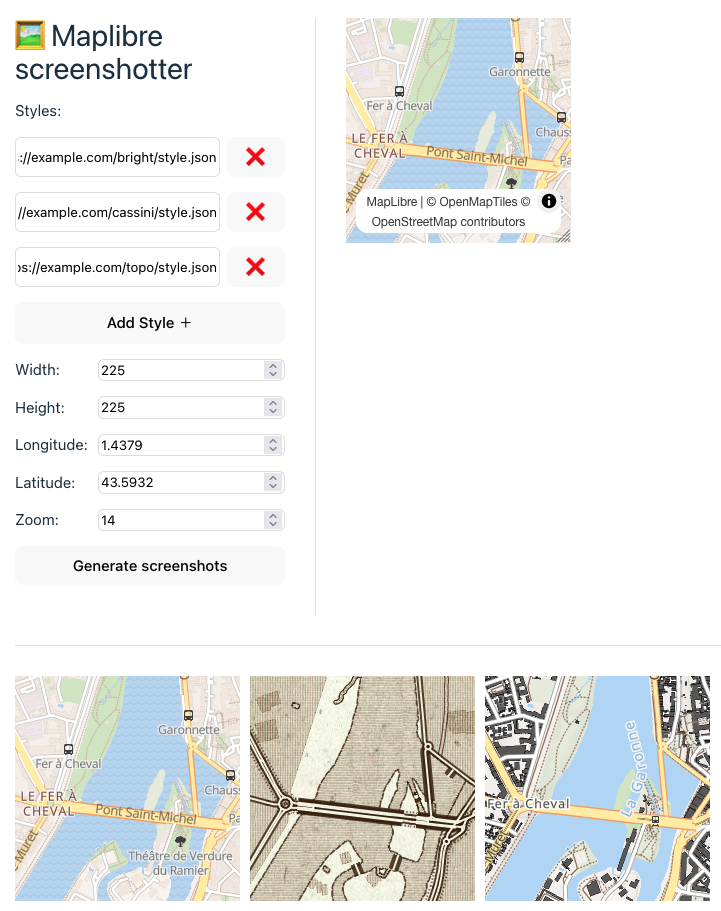

# maplibre-screenshotter

[Demo](https://maplibre-screenshotter.netlify.app/)

1. Add some style.json urls
2. Define coordinates, zoom and size
3. ???
4. Profit!! (if you have a way to profit from screenshots of basemaps)



## Project Setup

```sh
npm install
```

### Compile and Hot-Reload for Development

```sh
npm run dev
```

### Compile and Minify for Production

```sh
npm run build
```

### Lint with [ESLint](https://eslint.org/)

```sh
npm run lint
```

The generated screenshots don't have attributions, make sure to include some wherever you're going to display them
